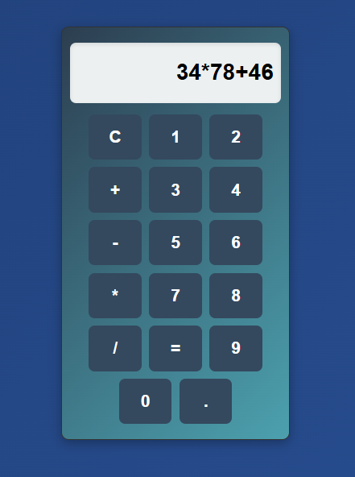

# 🧮 React Calculator
A simple calculator built using React.js. It supports basic arithmetic operations such as addition, subtraction, multiplication, and division.

🚀 Features
Basic arithmetic operations (+, -, *, /)
Clear (C) button to reset input
Responsive and user-friendly UI
Live calculations on button click

🖼️ Screenshot

🛠️ Technologies Used
React.js (Component-based UI)
CSS Modules (for styling)
JavaScript ES6+

📜 Usage
Click the number buttons to enter values.
Use the arithmetic operator buttons (+, -, *, /) for calculations.
Press = to display the result.
Use C to reset the calculator.